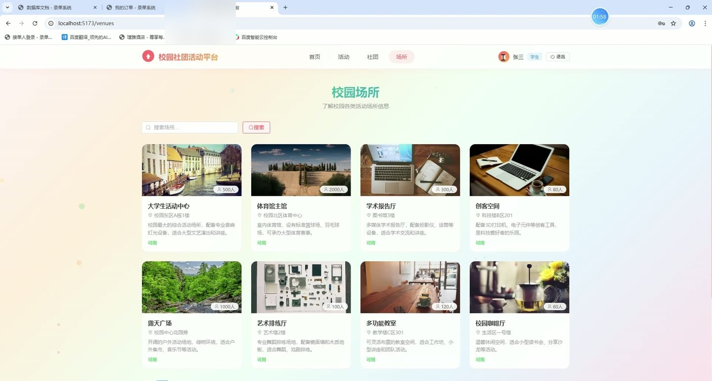
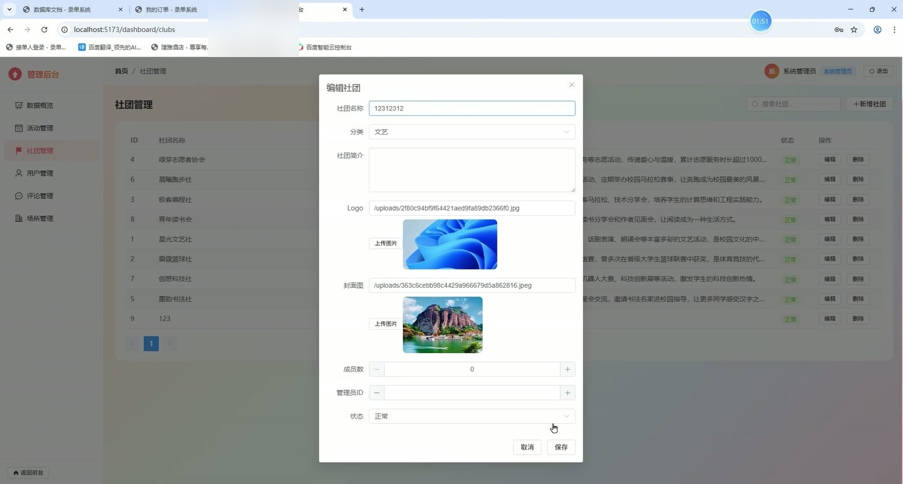
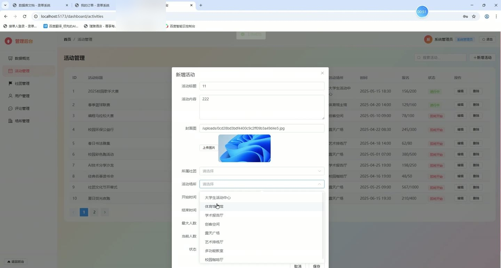
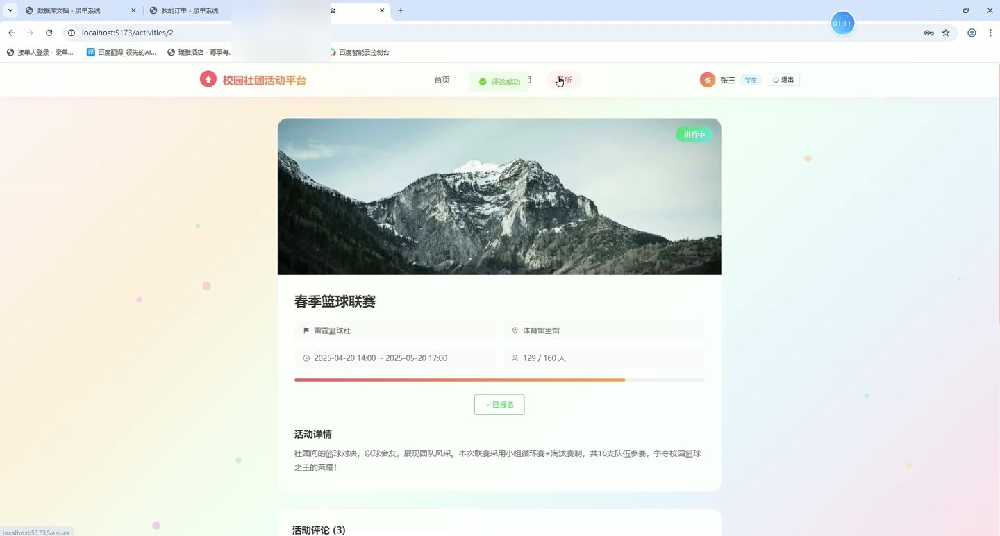

# (附文档)Springboot3+Vue3+MySQL 校园社团系统

**技术栈**：Springboot3、Vue3、MySQL

### 系统简介

校园社团活动系统是一套基于 Spring Boot 3 + Vue 3 前后端分离的社团管理平台，提供学生用户、社团管理员、系统管理员三种角色。学生可浏览社团、报名活动、查看已参加记录；社团管理员负责管理本社团的活动与评论；系统管理员进行用户、社团、场所、评论的全量管理。系统包含活动管理、社团管理、用户管理、场所管理、评论管理、数据统计等核心模块。
 
### 核心功能
 
### 普通用户端

 
- 浏览社团列表：支持按名称关键词搜索、按分类筛选，按成员数降序排列，仅显示已启用社团 
- 查看社团详情：点击社团卡片进入详情页，查看社团名称、简介、Logo、封面、分类、成员数 
- 加入社团：在社团详情页点击加入按钮，系统校验是否已加入，成功后更新成员数 
- 查看已加入社团：在“我的社团”页面列出当前用户加入的所有社团及加入时间 
- 浏览活动列表：支持按标题关键词搜索、按状态筛选、按社团筛选，按创建时间倒序排列 
- 查看活动详情：显示活动标题、内容、封面、所属社团、活动场所、起止时间、报名人数/最大人数、状态 
- 报名活动：在活动详情页点击报名，校验活动未结束、人数未满、未重复报名，成功后增加当前人数 
- 查看已报名活动：在“我的活动”页面列出当前用户报名的所有活动及报名时间 
- 浏览场所列表：查看所有可用的场所名称、位置、容纳人数、描述、图片 
- 发表评论：在活动详情页填写评论内容并提交，评论关联当前用户和活动 
- 快捷登录：登录页提供系统管理员、社团管理员、学生三个快捷登录按钮，自动填充用户名密码
 
### 社团管理员端

 
- 管理本社团活动：新增、编辑、删除活动时自动限定为本社团，无法操作其他社团的活动 
- 活动列表筛选：查看活动列表时只显示本社团的活动，支持关键词搜索 
- 编辑活动信息：可修改活动标题、内容、封面、所属社团（锁定为本社团）、活动场所、起止时间、最大人数、当前人数、状态 
- 上传活动封面：通过文件上传接口上传图片，自动返回图片URL填入封面字段 
- 管理本社团活动的评论：查看评论列表时只显示本社团活动的评论，支持分页 
- 隐藏/显示评论：可将评论状态切换为隐藏（0）或正常（1），前端对应显示或隐藏 
- 删除评论：删除本社团活动下的评论
 
### 管理员端

 
- 数据概览仪表盘：展示注册用户数、社团数量、活动数量、场所数量、评论数量五个统计卡片 
- 最近活动列表：在仪表盘显示最近5条活动及状态标签 
- 最新评论列表：在仪表盘显示最近5条评论及评论者昵称 
- 全量活动管理：查看所有活动列表，支持关键词搜索；新增、编辑、删除任意活动 
- 全量社团管理：查看所有社团列表，支持关键词搜索；新增、编辑、删除社团，可设置分类、Logo、封面、管理员ID、启用/禁用状态 
- 全量用户管理：查看所有用户列表，支持关键词搜索和角色筛选；新增、编辑、删除用户，可设置用户名、密码、昵称、角色、头像、手机号、邮箱、启用/禁用状态 
- 全量场所管理：查看所有场所列表，支持关键词搜索；新增、编辑、删除场所，可设置名称、位置、容纳人数、描述、图片、可用/不可用状态 
- 全量评论管理：查看所有评论列表，支持分页；可隐藏/显示或删除任意评论 
- 文件上传：通过 /api/file/upload 接口上传图片，返回访问路径
 
### 技术栈

 后端框架Spring Boot 3 ORMMyBatis-Plus (含分页插件 PaginationInnerInterceptor) 权限控制前端路由守卫 + 后端角色字段 (ADMIN / CLUB_ADMIN / STUDENT) 校验 前端框架Vue 3 (Composition API) 状态管理sessionStorage 存储登录用户信息 构建工具Vite 数据库MySQL 8 (数据库名 school_club) 其他Hutool (MD5 加密)、Element Plus (UI 组件库)、Axios (HTTP 请求)
 
### 交付内容

 
- 后端完整源码 
- 前端完整源码 
- 数据库初始化脚本 
- 万字文档

## 界面展示

---

## 获取完整源码 + 万字文档

本仓库为项目介绍页。**完整前后端源码、数据库初始化脚本、万字项目文档**，请加微信 `kangkangcode`，或访问 [codekk.top](http://codekk.top) 获取。

可作课程设计 / 毕业设计参考，支持远程部署调试。